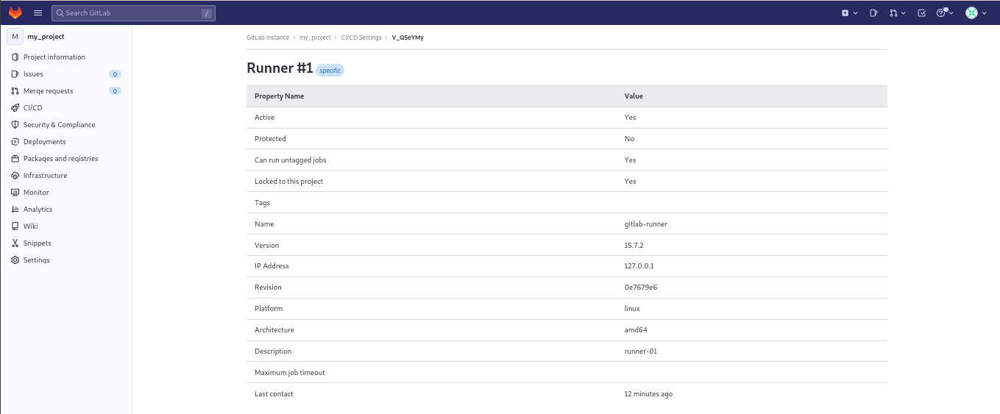

# Домашнее задание к занятию "`8.3. GitLab"` - `Калбазов Андрей`

### Задание 1

Что нужно сделать:

    1. Разверните GitLab локально, используя Vagrantfile и инструкцию, описанные в этом репозитории.
    2. Создайте новый проект и пустой репозиторий в нём.
    3. Зарегистрируйте gitlab-runner для этого проекта и запустите его в режиме Docker. Раннер можно регистрировать и запускать на той же виртуальной машине, на которой запущен GitLab.

<ins>В качестве ответа в репозиторий шаблона с решением добавьте скриншоты с настройками раннера в проекте<ins>

    

---
### Задание 2

Что нужно сделать:

    1. Запушьте репозиторий на GitLab, изменив origin. Это изучалось на занятии по Git.
    2. Создайте .gitlab-ci.yml, описав в нём все необходимые, на ваш взгляд, этапы.

<ins>В качестве ответа в шаблон с решением добавьте:<ins>
   <ins> 1. Файл gitlab-ci.yml для своего проекта или вставьте код в соответствующее поле в шаблоне;<ins>
   <ins> 2. Скриншоты с успешно собранными сборками.<ins>

    
