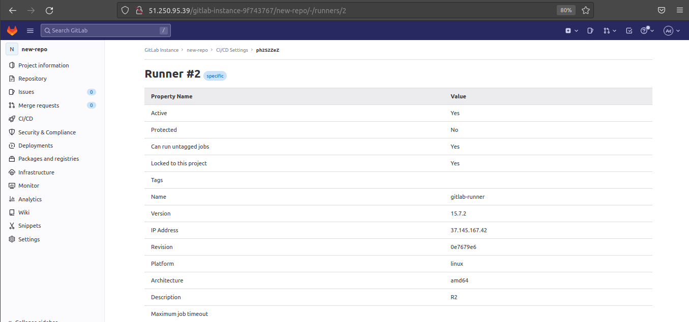

## Домашнее задание к занятию "`8.3. GitLab"` - `Калбазов Андрей`

### Задание 1

### Задание 1

Что нужно сделать:

    1. Установите себе jenkins по инструкции из лекции или любым другим способом из официальной документации. Использовать Docker в этом задании нежелательно.
    2. Установите на машину с jenkins golang.
    3. Используя свой аккаунт на GitHub, сделайте себе форк репозитория. В этом же репозитории находится дополнительный материал для выполнения ДЗ.
    4. Создайте в jenkins Freestyle Project, подключите получившийся репозиторий к нему и произведите запуск тестов и сборку проекта go test . и docker build ..

<ins>В качестве ответа пришлите скриншоты с настройками проекта и результатами выполнения сборки<ins>

---

---
Что нужно сделать:

        1. Разверните GitLab локально, используя Vagrantfile и инструкцию, описанные в этом репозитории.
        2. Создайте новый проект и пустой репозиторий в нём.
        3. Зарегистрируйте gitlab-runner для этого проекта и запустите его в режиме Docker. Раннер можно регистрировать и запускать на той же виртуальной машине, на которой запущен GitLab.

<ins>В качестве ответа в репозиторий шаблона с решением добавьте скриншоты с настройками раннера в проекте<ins>

    
    
    
    
---
### Задание 2

Что нужно сделать:

    1. Запушьте репозиторий на GitLab, изменив origin. Это изучалось на занятии по Git.
    2. Создайте .gitlab-ci.yml, описав в нём все необходимые, на ваш взгляд, этапы.

<ins>В качестве ответа в шаблон с решением добавьте:<ins>
   <ins> Файл gitlab-ci.yml для своего проекта или вставьте код в соответствующее поле в шаблоне;<ins>
   <ins> Скриншоты с успешно собранными сборками.<ins>

    
